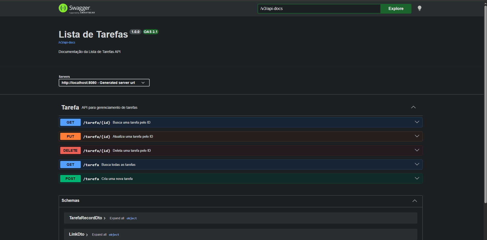

# Lista de Tarefas API

API para gerenciamento de tarefas com hipermídias (HATEOAS), documentação (Swagger), validações personalizadas e tratamento de exceções.



## 🔨 Tecnologias

- [SpringBoot](https://spring.io/projects/spring-boot)
- [SpringMVC](https://docs.spring.io/spring-framework/reference/web/webmvc.html)
- [Spring Data JPA](https://spring.io/projects/spring-data-jpa)
- [Spring Doc OpenAPI](https://springdoc.org/v2/#spring-webflux-support)
- [Spring HATEOAS](https://spring.io/projects/spring-hateoas)
- [PostgreSQL](https://www.postgresql.org/download/)

## ✨ Funcionalidades

- CRUD completo de tarefas
- HATEOAS com links dinâmicos
- Validações personalizadas
- Tratamento global de exceções
- Documentação interativa com Swagger

## 🌐 API Endpoints

| Método   | Endpoint       | Descrição               |
| :------- | :------------- | :---------------------- |
| `GET`    | `/tarefa`      | Lista todas as tarefas  |
| `GET`    | `/tarefa/{id}` | Busca uma tarefa por ID |
| `POST`   | `/tarefa`      | Cria uma nova tarefa    |
| `PUT`    | `/tarefa/{id}` | Atualiza uma tarefa     |
| `DELETE` | `/tarefa/{id}` | Remove uma tarefa       |

### Criar Tarefa

```bash
curl -X POST http://localhost:8080/tarefa \
  -H "Content-Type: application/json" \
  -d '{"nome":"Academia","descricao":"Treino de pernas","realizado":false,"prioridade":1}'
```

```json
{
  "_embedded": {
    "tarefaModelList": [
      {
        "_links": {
          "self": {
            "href": "http://localhost:8080/tarefa/69d0bdfe-3e21-4fbf-ad41-3ea18a8c832f"
          },
          "update-tarefa": {
            "href": "http://localhost:8080/tarefa/69d0bdfe-3e21-4fbf-ad41-3ea18a8c832f"
          },
          "delete-tarefa": {
            "href": "http://localhost:8080/tarefa/69d0bdfe-3e21-4fbf-ad41-3ea18a8c832f"
          }
        },
        "nome": "Academia",
        "descricao": "Treino de pernas",
        "realizado": false,
        "prioridade": 1,
        "id": "69d0bdfe-3e21-4fbf-ad41-3ea18a8c832f"
      }
    ]
  }
}
```

### Listar Tarefas

```bash
curl http://localhost:8080/tarefa
```

```json
{
  "_embedded": {
    "tarefaModelList": [
      {
        "_links": {
          "self": {
            "href": "http://localhost:8080/tarefa/69d0bdfe-3e21-4fbf-ad41-3ea18a8c832f"
          },
          "update-tarefa": {
            "href": "http://localhost:8080/tarefa/69d0bdfe-3e21-4fbf-ad41-3ea18a8c832f"
          },
          "delete-tarefa": {
            "href": "http://localhost:8080/tarefa/69d0bdfe-3e21-4fbf-ad41-3ea18a8c832f"
          }
        },
        "nome": "Academia",
        "descricao": "Treino de pernas",
        "realizado": false,
        "prioridade": 1,
        "id": "69d0bdfe-3e21-4fbf-ad41-3ea18a8c832f"
      },
      {
        "_links": {
          "self": {
            "href": "http://localhost:8080/tarefa/d195eb88-9704-4a22-8b61-3c4b9b1ddf98"
          },
          "update-tarefa": {
            "href": "http://localhost:8080/tarefa/d195eb88-9704-4a22-8b61-3c4b9b1ddf98"
          },
          "delete-tarefa": {
            "href": "http://localhost:8080/tarefa/d195eb88-9704-4a22-8b61-3c4b9b1ddf98"
          }
        },
        "nome": "Estudar Spring Boot",
        "descricao": "Revisar o modulo de seguranca",
        "realizado": false,
        "prioridade": 2,
        "id": "d195eb88-9704-4a22-8b61-3c4b9b1ddf98"
      },
      {
        "_links": {
          "self": {
            "href": "http://localhost:8080/tarefa/eba75e58-bec5-4a75-a2de-d7ed1eaabea9"
          },
          "update-tarefa": {
            "href": "http://localhost:8080/tarefa/eba75e58-bec5-4a75-a2de-d7ed1eaabea9"
          },
          "delete-tarefa": {
            "href": "http://localhost:8080/tarefa/eba75e58-bec5-4a75-a2de-d7ed1eaabea9"
          }
        },
        "nome": "Comprar pao atualizado",
        "descricao": "Comprar pao na padaria",
        "realizado": true,
        "prioridade": 2,
        "id": "eba75e58-bec5-4a75-a2de-d7ed1eaabea9"
      }
    ]
  },
  "_links": {
    "self": { "href": "http://localhost:8080/tarefa" },
    "create-tarefa": { "href": "http://localhost:8080/tarefa" }
  }
}
```

### Buscar Tarefa por ID

```bash
curl http://localhost:8080/tarefa/eba75e58-bec5-4a75-a2de-d7ed1eaabea9
```

```json
{
  "_links": {
    "self": {
      "href": "http://localhost:8080/tarefa/eba75e58-bec5-4a75-a2de-d7ed1eaabea9"
    },
    "update-tarefa": {
      "href": "http://localhost:8080/tarefa/eba75e58-bec5-4a75-a2de-d7ed1eaabea9"
    },
    "delete-tarefa": {
      "href": "http://localhost:8080/tarefa/eba75e58-bec5-4a75-a2de-d7ed1eaabea9"
    },
    "all-tarefas": {
      "href": "http://localhost:8080/tarefa"
    }
  },
  "nome": "Comprar pao",
  "descricao": "Comprar pao na padaria",
  "realizado": false,
  "prioridade": 3,
  "id": "eba75e58-bec5-4a75-a2de-d7ed1eaabea9"
}
```

### Atualizar Tarefa

```bash
curl -X PUT http://localhost:8080/tarefa/eba75e58-bec5-4a75-a2de-d7ed1eaabea9 \
  -H "Content-Type: application/json" \
  -d '{"nome":"Comprar pao atualizado","descricao":"Comprar pao na padaria","realizado":true,"prioridade":2}'
```

```json
{
  "_embedded": {
    "tarefaModelList": [
      {
        "_links": {
          "self": {
            "href": "http://localhost:8080/tarefa/69d0bdfe-3e21-4fbf-ad41-3ea18a8c832f"
          },
          "update-tarefa": {
            "href": "http://localhost:8080/tarefa/69d0bdfe-3e21-4fbf-ad41-3ea18a8c832f"
          },
          "delete-tarefa": {
            "href": "http://localhost:8080/tarefa/69d0bdfe-3e21-4fbf-ad41-3ea18a8c832f"
          }
        },
        "nome": "Academia",
        "descricao": "Treino de pernas",
        "realizado": false,
        "prioridade": 1,
        "id": "69d0bdfe-3e21-4fbf-ad41-3ea18a8c832f"
      },
      {
        "_links": {
          "self": {
            "href": "http://localhost:8080/tarefa/d195eb88-9704-4a22-8b61-3c4b9b1ddf98"
          },
          "update-tarefa": {
            "href": "http://localhost:8080/tarefa/d195eb88-9704-4a22-8b61-3c4b9b1ddf98"
          },
          "delete-tarefa": {
            "href": "http://localhost:8080/tarefa/d195eb88-9704-4a22-8b61-3c4b9b1ddf98"
          }
        },
        "nome": "Estudar Spring Boot",
        "descricao": "Revisar o modulo de seguranca",
        "realizado": false,
        "prioridade": 2,
        "id": "d195eb88-9704-4a22-8b61-3c4b9b1ddf98"
      },
      {
        "_links": {
          "self": {
            "href": "http://localhost:8080/tarefa/eba75e58-bec5-4a75-a2de-d7ed1eaabea9"
          },
          "update-tarefa": {
            "href": "http://localhost:8080/tarefa/eba75e58-bec5-4a75-a2de-d7ed1eaabea9"
          },
          "delete-tarefa": {
            "href": "http://localhost:8080/tarefa/eba75e58-bec5-4a75-a2de-d7ed1eaabea9"
          }
        },
        "nome": "Comprar pao atualizado",
        "descricao": "Comprar pao na padaria",
        "realizado": true,
        "prioridade": 2,
        "id": "eba75e58-bec5-4a75-a2de-d7ed1eaabea9"
      }
    ]
  },
  "_links": {
    "self": { "href": "http://localhost:8080/tarefa" },
    "create-tarefa": { "href": "http://localhost:8080/tarefa" }
  }
}
```

### Deletar Tarefa

```bash
curl -X DELETE http://localhost:8080/tarefa/eba75e58-bec5-4a75-a2de-d7ed1eaabea9
```

```json
{
  "_embedded": {
    "tarefaModelList": [
      {
        "_links": {
          "self": {
            "href": "http://localhost:8080/tarefa/69d0bdfe-3e21-4fbf-ad41-3ea18a8c832f"
          },
          "update-tarefa": {
            "href": "http://localhost:8080/tarefa/69d0bdfe-3e21-4fbf-ad41-3ea18a8c832f"
          },
          "delete-tarefa": {
            "href": "http://localhost:8080/tarefa/69d0bdfe-3e21-4fbf-ad41-3ea18a8c832f"
          }
        },
        "nome": "Academia",
        "descricao": "Treino de pernas",
        "realizado": false,
        "prioridade": 1,
        "id": "69d0bdfe-3e21-4fbf-ad41-3ea18a8c832f"
      },
      {
        "_links": {
          "self": {
            "href": "http://localhost:8080/tarefa/d195eb88-9704-4a22-8b61-3c4b9b1ddf98"
          },
          "update-tarefa": {
            "href": "http://localhost:8080/tarefa/d195eb88-9704-4a22-8b61-3c4b9b1ddf98"
          },
          "delete-tarefa": {
            "href": "http://localhost:8080/tarefa/d195eb88-9704-4a22-8b61-3c4b9b1ddf98"
          }
        },
        "nome": "Estudar Spring Boot",
        "descricao": "Revisar o modulo de seguranca",
        "realizado": false,
        "prioridade": 2,
        "id": "d195eb88-9704-4a22-8b61-3c4b9b1ddf98"
      }
    ]
  },
  "_links": {
    "all-tarefas": { "href": "http://localhost:8080/tarefa" }
  }
}
```

## 🧠 Práticas adotadas

- API REST
- Consultas com Spring Data JPA
- Injeção de Dependências
- Tratamento de Respostas de erro
- Geração automática do Swagger com a OpenAPI

## 🗂️ Estrutura do projeto

As pastas abaixo ficam em `src/main/java/com/todolist/list/`:

- `list/`: pasta raiz da aplicação, onde está a classe que inicializa o Spring Boot.
- `configuration/`: configurações da aplicação, incluindo a documentação OpenAPI/Swagger e os formatos de erro da API.
- `controller/`: controladores REST responsáveis por receber as requisições HTTP e montar as respostas.
- `dto/`: objetos de transferência de dados usados para representar dados de entrada e saída da API.
- `exceptions/`: tratamento global de exceções e estrutura padronizada das respostas de erro.
- `model/`: entidades de domínio persistidas e componentes que as convertem em representações HATEOAS.
- `repository/`: interfaces de acesso e persistência de dados com Spring Data JPA.
- `service/`: regras e operações de negócio relacionadas às tarefas.
- `validator/`: validações personalizadas para os dados das tarefas.

Os testes ficam em `src/test/java/com/todolist/list/`, nas pastas `controller/` e `service/`, que cobrem essas respectivas camadas.

## 🚀 Como Executar

### Pré-requisitos

- Java 26
- PostgreSQL 18
- (Opcional) Git

### 1. Clonar o repositório

```bash
git clone https://github.com/devVitoroliveira/ListaDeTarefas.git
cd ListaDeTarefas
```

### 2. Configurar o banco de dados

Crie o banco 'TodoList' no PostgreSQL

```sql
CREATE DATABASE "TodoList";
```

Configure as credenciais em src/main/resources/application.properties

```properties
spring.datasource.url=jdbc:postgresql://localhost:5432/TodoList
spring.datasource.username=seu_usuario
spring.datasource.password=sua_senha
```

Nota: as tabelas são criadas automaticamente pelo Hibernate (ddl-auto=update).

### 3. Executar a aplicação

```bash
./mvnw spring-boot:run
```

### 4. Acessar a aplicação

- Swagger UI: http://localhost:8080/swagger-ui.html

## 🧪 Testes

O projeto conta com testes unitários para as camadas de **Service** e **Controller**, garantindo a qualidade da lógica de negócio e dos endpoints da API.

### Como rodar

```bash
./mvnw test
```

### O que é testado

**Service (TarefaServiceTest)**

- Cenários de sucesso (salvar, buscar, atualizar, deletar).
- Cenários de recurso não encontrado.
- Cenários de exceção (ex: DataIntegrityViolationException).
- Uso de Mockito para isolar o repositório.

**Controller (TarefaControllerTest)**

- Status HTTP corretos (200, 201, 400, 404, 405).
- Corpo da resposta (campos esperados, links HATEOAS).
- Uso de @WebMvcTest(TarefaController.class) e MockMvc para simular requisições HTTP.

### Ferramentas

- JUnit 5
- Mockito
- AssertJ
- Spring MockMvc

## 📊 Observabilidade

O projeto usa **Spring Boot Actuator** para expor endpoints de monitoramento:

- `GET /actuator/health` — status da aplicação e do banco de dados.
- `GET /actuator/info` — informações do projeto.

Esses endpoints permitem que a aplicação seja monitorada em produção, facilitando a detecção de problemas e a integração com ferramentas de orquestração.

## 📖 Documentação da API

A documentação interativa da API está disponível via Swagger UI após iniciar a aplicação:

- **Local:** http://localhost:8080/swagger-ui.html

A documentação inclui:

- Descrição de todos os endpoints.
- Exemplos de requisição e resposta.
- Schemas dos DTOs com validações.
- Links HATEOAS de cada recurso.
